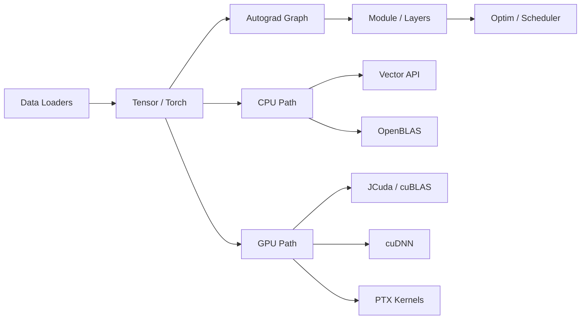

# ML Framework

[Tiếng Việt](README.md) | [Tutorial](TUTORIAL.en.md) | [Tutorial VI](TUTORIAL.md) | [API Reference](API_REFERENCE.en.md) | [API Reference VI](API_REFERENCE.md)


This is a Java machine learning framework inspired by PyTorch. It is designed for three goals at once: learning how deep learning frameworks work internally, training models directly in Java, and progressively scaling from CPU execution to GPU execution through JCuda, cuBLAS, and cuDNN.

The repository already includes a tensor engine, autograd, a `Module/Parameter` system, data loaders, optimizers, CNNs, RNNs, Transformers, mixed precision, OpenBLAS integration, custom CUDA kernels, and a fully passing regression suite.

## Getting Started

If you only want the shortest path to a working setup, run these three commands:

```powershell
powershell -ExecutionPolicy Bypass -File tests\run-tests.ps1
java --add-modules jdk.incubator.vector -cp "bin;lib/*" com.user.nn.examples.TrainIris
java --add-modules jdk.incubator.vector -cp "bin;lib/*" com.user.nn.examples.TrainFashionMNIST
```

Then continue with:

- `TUTORIAL.en.md` for the step-by-step onboarding guide.
- `API_REFERENCE.en.md` for the package-level API map.

## System Overview



## Highlights

- Tensor engine with reshape, broadcasting, indexing, reductions, transpose, gather/scatter, `matmul`, and `bmm`.
- Dynamic graph autograd with `requires_grad`, `grad_fn`, `backward()`, topological traversal, and version checking for in-place ops.
- PyTorch-like module system with `Sequential`, `ModuleList`, `ModuleDict`, and `Parameter`.
- Broad layer support: `Linear`, `Embedding`, `Conv1d`, `Conv2d`, `ConvTranspose2d`, pooling, normalization, attention, and transformer encoder blocks.
- CPU acceleration through the Java Vector API and OpenBLAS via JavaCPP/bytedeco.
- GPU acceleration through JCuda, cuBLAS, cuDNN, memory pools, CUDA streams, and custom PTX kernels.
- End-to-end examples for Iris, Fashion-MNIST, CIFAR-10, Sentiment Analysis, ViT, GAN, and VAE.
- 44 registered test classes currently passing in the PowerShell test runner.

## Reference Benchmarks

The numbers below were collected from the current repository state using the built-in benchmark tests. They are representative measurements, not universal guarantees.

| Task | Backend | Size | Latest measured result |
|---|---|---|---|
| Large CPU matmul | OpenBLAS | `256 x 256` | `0.58 ms / matmul` |
| Vectorized CPU matmul | Java Vector API | benchmark suite | `19.10 ms / matmul` |
| Regression suite | PowerShell runner | 44 test classes | full pass |

## Companion Docs

- `TUTORIAL.en.md`: step-by-step onboarding in English
- `TUTORIAL.md`: Vietnamese tutorial
- `API_REFERENCE.en.md`: package-level API map in English
- `API_REFERENCE.md`: package-level API map in Vietnamese

---

Documentation updated for the current codebase state on 2026-03-09.
