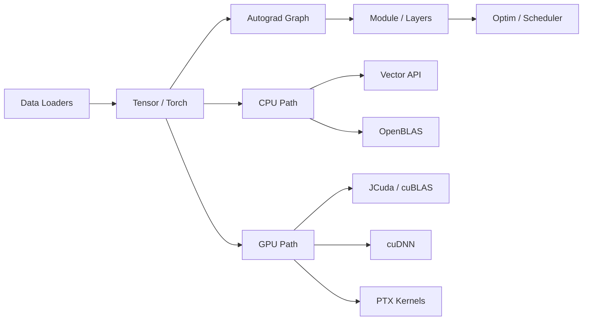

# ML Framework

[English](README.en.md) | [Tutorial](TUTORIAL.md) | [Tutorial EN](TUTORIAL.en.md) | [API Reference](API_REFERENCE.md) | [API Reference EN](API_REFERENCE.en.md)


Framework hoc may viet bang Java, lay cam hung tu PyTorch, phuc vu dong thoi 3 muc tieu: hoc cach deep learning hoat dong o muc framework, huan luyen mo hinh truc tiep trong Java, va mo rong dan tu CPU sang GPU bang JCuda, cuBLAS va cuDNN.

Repo hien da co tensor engine, autograd, he `Module/Parameter`, dataloader, optimizer, CNN, RNN, Transformer, mixed precision, OpenBLAS, custom CUDA kernels va bo test hoi quy dang pass toan bo.

## Getting Started

Neu ban chi muon bat dau that nhanh, chay dung 3 lenh nay:

```powershell
powershell -ExecutionPolicy Bypass -File tests\run-tests.ps1
java --add-modules jdk.incubator.vector -cp "bin;lib/*" com.user.nn.examples.TrainIris
java --add-modules jdk.incubator.vector -cp "bin;lib/*" com.user.nn.examples.TrainFashionMNIST
```

Sau do doc tiep:

- `TUTORIAL.md` neu ban muon hoc theo tung buoc bang tieng Viet.
- `API_REFERENCE.md` neu ban can ban do package va API chinh.

## So do tong quan



## Diem noi bat

- Tensor engine co reshape, broadcasting, indexing, reduction, transpose, gather/scatter, `matmul`, `bmm`.
- Autograd dynamic graph voi `requires_grad`, `grad_fn`, `backward()`, topological sort va version checking cho in-place ops.
- He `Module` kieu PyTorch voi `Sequential`, `ModuleList`, `ModuleDict`, `Parameter`.
- Layer cho nhieu bai toan pho bien: `Linear`, `Embedding`, `Conv1d`, `Conv2d`, `ConvTranspose2d`, pooling, norm, attention, transformer encoder.
- CPU acceleration bang Java Vector API va OpenBLAS qua JavaCPP/bytedeco.
- GPU acceleration bang JCuda, cuBLAS, cuDNN, memory pool, CUDA streams va PTX kernels tuy bien.
- Vi du end-to-end cho Iris, Fashion-MNIST, CIFAR-10, Sentiment Analysis, ViT, GAN, VAE.
- Bo test PowerShell hien dang ky 44 test class va dang pass toan bo.

## Benchmark tham khao

Cac so duoi day la ket qua do tren chinh repo hien tai bang benchmark san co. Day la so do dai dien, khong phai cam ket hieu nang tuyet doi vi con phu thuoc phan cung va moi truong.

| Tac vu | Duong chay | Kich thuoc | Ket qua do gan nhat |
|---|---|---|---|
| Matmul CPU lon | OpenBLAS | `256 x 256` | `0.58 ms / matmul` |
| Matmul CPU vectorized | Java Vector API | benchmark suite | `19.10 ms / matmul` |
| Regression suite | PowerShell runner | 44 test class | pass toan bo |

## Cong nghe chinh

| Thanh phan | Vai tro |
|---|---|
| Java 21 | Nen tang build va runtime |
| `jdk.incubator.vector` | SIMD cho phep toan CPU |
| JCuda / cuBLAS / cuDNN | Tang toc GPU cho tensor, matmul, conv, pooling, backward |
| OpenBLAS + JavaCPP | Tang toc `matmul` CPU kich thuoc lon |
| PowerShell scripts | Build, test va workflow tren Windows |

## Yeu cau moi truong

### Bat buoc

- Windows voi PowerShell.
- JDK 21 tro len. Repo hien da duoc kiem tra voi Temurin 21.0.10.
- `javac` va `java` trong `PATH`.

### Tuy chon nhung rat nen co

- NVIDIA GPU + CUDA driver neu muon dung duong GPU.
- CUDA toolkit neu muon build lai `kernels.cu` thanh `bin/kernels.ptx`.

### Dependency hien co trong repo

Thu muc `lib/` hien da chua cac JAR cho:

- JCuda
- JCublas
- JCudnn
- JavaCPP
- OpenBLAS

Trong phan lon truong hop, classpath `"bin;lib/*"` la du.

## Quick Start chi tiet

### 1. Compile toan bo framework

```powershell
javac --add-modules jdk.incubator.vector -d bin -cp "lib/*" `
    src\com\user\nn\core\*.java `
    src\com\user\nn\layers\*.java `
    src\com\user\nn\activations\*.java `
    src\com\user\nn\containers\*.java `
    src\com\user\nn\norm\*.java `
    src\com\user\nn\pooling\*.java `
    src\com\user\nn\rnn\*.java `
    src\com\user\nn\attention\*.java `
    src\com\user\nn\losses\*.java `
    src\com\user\nn\optim\*.java `
    src\com\user\nn\dataloaders\*.java `
    src\com\user\nn\models\*.java `
    src\com\user\nn\models\cv\*.java `
    src\com\user\nn\models\generative\*.java `
    src\com\user\nn\metrics\*.java `
    src\com\user\nn\examples\*.java
```

### 2. Chay toan bo test

```powershell
powershell -ExecutionPolicy Bypass -File tests\run-tests.ps1
```

### 3. Chay vi du don gian nhat

```powershell
java --add-modules jdk.incubator.vector -cp "bin;lib/*" com.user.nn.examples.TrainIris
```

## Lo trinh nen chay vi du

| Vi du | Muc tieu | Khi nao nen chay |
|---|---|---|
| `TrainIris` | Classification nho, de doc code | Bat dau o day |
| `TrainFashionMNIST` | Dataloader, mini-batch, MLP, GPU training | Sau Iris |
| `TrainSentiment` | NLP pipeline voi `Embedding` va LSTM | Khi muon xem text workflow |
| `TrainCifar10` | CNN tren du lieu anh that | Khi muon benchmark GPU |
| `TrainResNetCifar10` | Residual architecture | Sau khi quen CNN |
| `TrainViTCifar10` | Vision Transformer | Khi tim hieu attention |
| `TrainGANMnist` | Generative experiment | Khi muon mo rong nghien cuu |
| `TrainVAEMnist` | Variational autoencoder | Khi muon thu latent models |
| `TrainLeNet` | CNN co dien gon nhe | Khi can debug nhanh |

## Cau truc repo

```text
src/com/user/nn/
  core/           Tensor, Torch, Functional, CUDAOps, GpuMemoryPool, MixedPrecision
  layers/         Linear, Conv, Embedding, Dropout, Bilinear
  activations/    ReLU, Sigmoid, Tanh, GELU, Softplus, Softmax, ...
  containers/     Sequential, ModuleList, ModuleDict, Flatten
  norm/           BatchNorm, LayerNorm, InstanceNorm, GroupNorm
  pooling/        MaxPool, AvgPool, AdaptiveAvgPool, ZeroPad
  attention/      MultiheadAttention, TransformerEncoderLayer
  rnn/            RNN, LSTM, GRU va cell tuong ung
  losses/         BCE, CrossEntropy, KLDiv, cosine, pairwise distance
  optim/          SGD, Adam, scheduler
  dataloaders/    Dataset, DataLoader, loader cho MNIST/CIFAR/Sentiment
  models/         Model hoan chinh cho NLP, CV va generative
  examples/       Chuong trinh train end-to-end

tests/
  java/com/user/nn/   Toan bo test Java
  run-tests.ps1       Script compile + chay regression suite
```

## Kien truc van hanh

### Tensor va autograd

`Tensor` la loi cua framework. Moi tensor giu shape, du lieu CPU, con tro GPU, `requires_grad`, gradient tich luy, `grad_fn` va version counter de phat hien in-place mutation pha graph.

### Device-aware execution

Framework dispatch theo thiet bi:

- tensor o CPU thi dung CPU path
- tensor o GPU thi uu tien GPU path
- phep toan lon tren CPU co the dung OpenBLAS
- phep toan GPU dung cuBLAS, cuDNN hoac PTX kernel tuy bien
- neu GPU khong kha dung thi fallback ve CPU khi co the

### Memory management

Repo hien co 3 tang quan ly bo nho quan trong:

- `AutoCloseable` tren `Tensor`
- `Cleaner` thay cho `finalize()` cho GPU memory safety net
- `MemoryScope` + `GpuMemoryPool` de giam overhead VRAM trong training loop

## Tai lieu di kem

- `TUTORIAL.md`: huong dan tung buoc bang tieng Viet
- `TUTORIAL.en.md`: tutorial tieng Anh
- `API_REFERENCE.md`: package reference tieng Viet
- `API_REFERENCE.en.md`: package reference tieng Anh

## Ghi chu thuc te

- Mot so vi du tu tai du lieu neu thieu, mot so khac dung du lieu da co san trong `data/`.
- Tai lieu uu tien PowerShell tren Windows vi repo hien toi uu theo moi truong nay.
- Tren Windows, classpath dung dau `;`.
- Neu sua `src/com/user/nn/core/kernels.cu`, ban can build lai PTX tuong ung.

---

Tai lieu duoc cap nhat theo trang thai code hien tai vao 2026-03-09.
