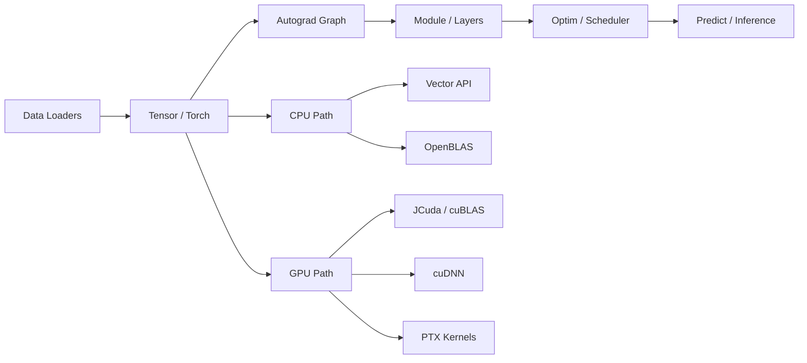

# JavaTorch - Pytorch but in java

[Tieng Viet](README.vn.md) | [Tutorial](TUTORIAL.md) | [Tutorial VI](TUTORIAL.vn.md) | [API Reference](API_REFERENCE.md) | [API Reference VI](API_REFERENCE.vn.md)


This is a Java machine learning framework inspired by PyTorch. It is designed for three goals at once: learning how deep learning frameworks work internally, training models directly in Java, and progressively scaling from CPU execution to GPU execution through JCuda, cuBLAS, and cuDNN.

The repository already includes a tensor engine, autograd, a `Module/Parameter` system, data loaders, optimizers, CNNs, RNNs, Transformers, mixed precision, OpenBLAS integration, custom CUDA kernels, and a fully passing regression suite.

## Getting Started

If you only want the shortest path to a working setup, run these three commands:

```powershell
gradle wrapper
.\gradlew.bat :core:test
.\gradlew.bat :core:build
```

Then continue with:

- `TUTORIAL.md` for the step-by-step onboarding guide.
- `API_REFERENCE.md` for the package-level API map.

## System Overview



## Highlights

- Tensor engine with reshape, broadcasting, indexing, reductions, transpose, gather/scatter, `matmul`, and `bmm`.
- Dynamic graph autograd with `requires_grad`, `grad_fn`, `backward()`, topological traversal, and version checking for in-place ops.
- PyTorch-like module system with `Sequential`, `ModuleList`, `ModuleDict`, and `Parameter`.
- Broad layer support: `Linear`, `Embedding`, `Conv1d`, `Conv2d`, `ConvTranspose2d`, pooling, normalization, attention, and transformer encoder blocks.
- CPU acceleration through the Java Vector API and OpenBLAS via JavaCPP/bytedeco.
- GPU acceleration through JCuda, cuBLAS, cuDNN, memory pools, CUDA streams, custom PTX kernels, and `GpuMemoryMonitor` for VRAM tracking.
- Prediction library with `Predictor`, `ImagePredictor`, `TextPredictor`, `BatchPredictor`, and `PredictionPipeline` for model inference.
- **Real-time Web Dashboard**: Local Javalin + Vue 3 UI for live Chart.js metrics, VRAM monitoring, and interactive inference playgrounds (Image & Text).
- End-to-end examples for Iris, Fashion-MNIST, CIFAR-10, Sentiment Analysis, ViT, GAN, and VAE — all with integrated prediction demos.
- 45 registered test classes currently passing in the PowerShell test runner.

## Prediction / Inference

The `predict` package provides a complete inference pipeline after training:

```java
// Image classification
ImagePredictor predictor = ImagePredictor.forCifar10(model);
PredictionResult result = predictor.predictFromPixels(imageData);
System.out.println(result); // → airplane (0.9132), top-5 shown

// Text sentiment
TextPredictor tp = TextPredictor.forSentiment(model, vocab, maxLen);
System.out.println(tp.predictSentiment("Great movie!")); // → POSITIVE (0.92)

// Batch evaluation
BatchPredictor bp = new BatchPredictor(predictor);
float acc = bp.evaluateAccuracy(testLoader);
int[][] cm = bp.confusionMatrix(testLoader, 10);

// Fluent pipeline
PredictionPipeline.create(model)
    .loadWeights("model.bin")
    .labels(CIFAR10_LABELS)
    .topK(5)
    .predict(input);
```

## Reference Benchmarks

The numbers below were collected from the current repository state using the built-in benchmark tests. They are representative measurements, not universal guarantees.

| Task | Backend | Size | Latest measured result |
|---|---|---|---|
| Large CPU matmul | OpenBLAS | `256 x 256` | `0.58 ms / matmul` |
| Vectorized CPU matmul | Java Vector API | benchmark suite | `19.10 ms / matmul` |
| Regression suite | PowerShell runner | 45 test classes | full pass |

## End-to-End Benchmark (Accuracy + Performance)

The repository now includes first-pass benchmark runners for:

- `resnet_cifar10` (ResNet-18 on CIFAR-10)
- `sentiment_rtpolarity` (LSTM sentiment on RT-Polarity)

Both runners export standardized artifacts under `benchmark/results`:

- `epoch_metrics.csv` (loss, accuracy, epoch time, memory telemetry)
- `inference_samples.csv` (per-step inference latency)
- `run_summary.csv` (best accuracy, total train time, p50/p95 latency, throughput)

Run each benchmark directly:

```powershell
.\gradlew.bat :examples:benchmarkResNet --args="--device=cpu --epochs=2 --batchSize=64 --seed=42"
.\gradlew.bat :examples:benchmarkSentiment --args="--device=cpu --epochs=3 --batchSize=16 --seed=42"
```

Run the full matrix orchestrator script:

```powershell
powershell -ExecutionPolicy Bypass -File scripts\run-benchmark-matrix.ps1 -Mode quick -Device both
```

Notes:

- Use `-Mode full` for longer runs.
- For deterministic baseline comparisons, start with `--device=cpu` and `--mixedPrecision=false`.
- GPU runs require the current CUDA/JCuda setup used by the framework.

## UIT-VSFC Multi-Task Benchmark

The UIT-VSFC multi-task runner now exports benchmark-compatible artifacts for both heads (sentiment/topic) and supports LSTM vs Transformer comparisons under the same split policy.

Dataset folder format expected by the loader:

- `examples/data/uit-vsfc/train/sents.txt`
- `examples/data/uit-vsfc/train/sentiments.txt`
- `examples/data/uit-vsfc/train/topics.txt`
- `examples/data/uit-vsfc/dev/sents.txt`
- `examples/data/uit-vsfc/dev/sentiments.txt`
- `examples/data/uit-vsfc/dev/topics.txt`
- `examples/data/uit-vsfc/test/sents.txt`
- `examples/data/uit-vsfc/test/sentiments.txt`
- `examples/data/uit-vsfc/test/topics.txt`

Label spaces:

- Sentiment: 3 classes
- Topic: 4 classes

Run one benchmark configuration:

```powershell
.\gradlew.bat "-PmainClass=com.user.nn.examples.TrainUitVsfcMultitask" :examples:run --args="--dataDir=examples/data/uit-vsfc --epochs=1 --batchSize=512 --maxLen=48 --model=lstm --device=cpu --seed=42 --alpha=1.0 --beta=1.0 --selection=weighted --inferWarmup=5 --inferSteps=20 --outputDir=benchmark/results" --no-daemon
```

Run reproducible matrix (model x device x seed):

```powershell
powershell -ExecutionPolicy Bypass -File scripts\run-uit-vsfc-matrix.ps1 -Mode quick -Device cpu -Models all -Seeds "42,1337"
```

Run UIT from the shared orchestrator (supports framework selection):

```powershell
powershell -ExecutionPolicy Bypass -File scripts\run-benchmark-matrix.ps1 -Mode quick -Device cpu -Tasks uit -Framework both -Seed 42
```

Notes:

- `-Framework JavaTorch` runs Java UIT matrix only.
- `-Framework pytorch` runs PyTorch UIT matrix only.
- `-Framework both` runs both for side-by-side comparison.

Generate UIT comparison report (Java vs PyTorch):

```powershell
.venv\Scripts\python.exe scripts\aggregate_uit_vsfc_compare.py --resultsDir benchmark/results --outputDir benchmark/results/compare/uit_vsfc_multitask
```

Only keep the newest run per `(framework, model, device, seed)`:

```powershell
.venv\Scripts\python.exe scripts\aggregate_uit_vsfc_compare.py --resultsDir benchmark/results --outputDir benchmark/results/compare/uit_vsfc_multitask --latestOnly
```

Keep newest runs and drop rows missing test macro-F1 metrics:

```powershell
.venv\Scripts\python.exe scripts\aggregate_uit_vsfc_compare.py --resultsDir benchmark/results --outputDir benchmark/results/compare/uit_vsfc_multitask --latestOnly --dropMissingMetrics
```

Run Phase 4 orchestration (aggregate + sanity checks + charts + markdown summary):

```powershell
powershell -ExecutionPolicy Bypass -File scripts\run-uit-vsfc-phase4-report.ps1 -Mode quick -Device cpu -Framework both -Models all -Seeds "42" -RunBenchmarks
```

Report outputs:

- `benchmark/results/compare/uit_vsfc_multitask/comparison.csv`
- `benchmark/results/compare/uit_vsfc_multitask/comparison.md`

Artifacts per run are written to:

- `benchmark/results/JavaTorch/uit_vsfc_multitask/<run_id>/epoch_metrics.csv`
- `benchmark/results/JavaTorch/uit_vsfc_multitask/<run_id>/inference_samples.csv`
- `benchmark/results/JavaTorch/uit_vsfc_multitask/<run_id>/run_summary.csv`
- `benchmark/results/JavaTorch/uit_vsfc_multitask/<run_id>/per_class_metrics.csv`
- `benchmark/results/JavaTorch/uit_vsfc_multitask/<run_id>/dev_confusion_*.csv`
- `benchmark/results/JavaTorch/uit_vsfc_multitask/<run_id>/test_confusion_*.csv`

## GAN Anime Training Notes

Recent fixes improved GAN Anime training stability on GPU and removed the common case where epoch loss prints `0.0000` due to skipped non-finite batches.

- BCE numerical clamp now uses a float-safe epsilon to avoid `log(0)` and `Infinity` in saturated discriminator outputs.
- Discriminator training applies backward on real/fake loss terms separately, which is more robust if scalar GPU add paths become unstable.
- Training logs now include batch health info (`Batches used/seen`, `Skipped D/G`) for faster debugging.

Recommended run command:

```powershell
.\gradlew.bat "-PmainClass=com.user.nn.examples.TrainGANAnime" :examples:run --args "data/anime_faces 30 64 -1" --no-daemon
```

## Companion Docs

- `TUTORIAL.md`: step-by-step onboarding in English
- `TUTORIAL.vn.md`: Vietnamese tutorial
- `API_REFERENCE.md`: package-level API map in English
- `API_REFERENCE.vn.md`: package-level API map in Vietnamese

## Build and Release Notes

- The default workflow is now Gradle-based (`:core`, `:examples`, `:tests`).
- Full wrapper generation is supported via `gradle wrapper`.
- Verified release command:

```powershell
.\gradlew.bat :core:clean :core:test :core:classes --no-daemon
```

- Example execution via Gradle (Recommended over raw `javac`/`java`):

```powershell
.\gradlew.bat "-PmainClass=com.user.nn.examples.TrainFashionMNIST" :examples:run --no-daemon
```

- Latest full verification (2026-03-10):

```powershell
.\gradlew.bat :core:test :tests:test :core:gpuSmoke :core:gpuNightly --continue
```

Result: `BUILD SUCCESSFUL`

- Legacy PowerShell runner remains available for compatibility:

```powershell
powershell -ExecutionPolicy Bypass -File tests\run-tests.ps1
```

- Automated CI/CD validation script (Gradle build + tests + examples smoke):

```powershell
powershell -ExecutionPolicy Bypass -File scripts\ci-test.ps1 -Mode quick
```

- Full examples smoke mode (runs all discovered example entrypoints with timeout):

```powershell
powershell -ExecutionPolicy Bypass -File scripts\ci-test.ps1 -Mode full -ExampleTimeoutSec 60
```

---

Documentation updated for the current codebase state on 2026-03-24.
