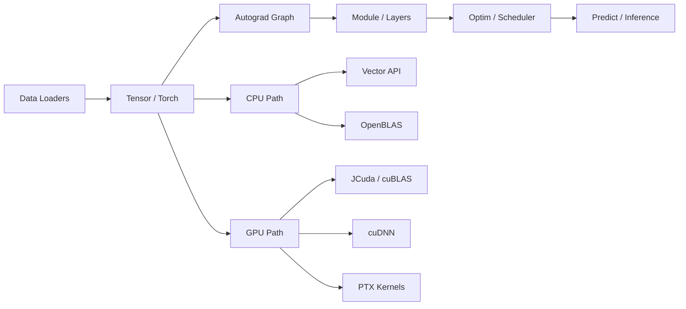

# ML Framework

[English](README.md) | [Tutorial](TUTORIAL.vn.md) | [Tutorial EN](TUTORIAL.md) | [API Reference](API_REFERENCE.vn.md) | [API Reference EN](API_REFERENCE.md)


Framework hoc may viet bang Java, lay cam hung tu PyTorch, phuc vu dong thoi 3 muc tieu: hoc cach deep learning hoat dong o muc framework, huan luyen mo hinh truc tiep trong Java, va mo rong dan tu CPU sang GPU bang JCuda, cuBLAS va cuDNN.

Repo hien da co tensor engine, autograd, he `Module/Parameter`, dataloader, optimizer, CNN, RNN, Transformer, mixed precision, OpenBLAS, custom CUDA kernels va bo test hoi quy dang pass toan bo.

## Getting Started

Neu ban chi muon bat dau that nhanh, chay dung 3 lenh nay:

```powershell
gradle wrapper
.\gradlew.bat :tests:test
.\gradlew.bat :core:build
```

Sau do doc tiep:

- `TUTORIAL.vn.md` neu ban muon hoc theo tung buoc bang tieng Viet.
- `API_REFERENCE.vn.md` neu ban can ban do package va API chinh.

## So do tong quan


```mermaid
flowchart LR
    A[Data Loaders] --> B[Tensor / Torch]
    B --> C[Autograd Graph]
    C --> D[Module / Layers]
    D --> E[Optim / Scheduler]
    E --> P[Predict / Inference]
    B --> F[CPU Path]
    B --> G[GPU Path]
    F --> H[Vector API]
    F --> I[OpenBLAS]
    G --> J[JCuda / cuBLAS]
    G --> K[cuDNN]
    G --> L[PTX Kernels]
```

## Diem noi bat

- Tensor engine co reshape, broadcasting, indexing, reduction, transpose, gather/scatter, `matmul`, `bmm`.
- Autograd dynamic graph voi `requires_grad`, `grad_fn`, `backward()`, topological sort va version checking cho in-place ops.
- He `Module` kieu PyTorch voi `Sequential`, `ModuleList`, `ModuleDict`, `Parameter`.
- Layer cho nhieu bai toan pho bien: `Linear`, `Embedding`, `Conv1d`, `Conv2d`, `ConvTranspose2d`, pooling, norm, attention, transformer encoder.
- CPU acceleration bang Java Vector API va OpenBLAS qua JavaCPP/bytedeco.
- GPU acceleration bang JCuda, cuBLAS, cuDNN, **memory pool tu dong mo rong**, CUDA streams, PTX kernels tuy bien, va theo doi VRAM voi `GpuMemoryMonitor`.
- Thu vien predict voi `Predictor`, `ImagePredictor`, `TextPredictor`, `BatchPredictor` va `PredictionPipeline` cho inference.
- **Neural Dashboard (Phiên bản cao cấp)**: Dashboard web hiệu năng cao được xây dựng với Vue 3, Tailwind CSS và WebSocket. Giao diện tối chuyên nghiệp (Neural Overlay) với hiệu ứng kính mờ (glassmorphism).
- **Giao diện chuyên biệt thời gian thực**:
  - **Phân loại (Classification)**: Lưới dự đoán trực tiếp với thanh độ tin cậy và bản đồ nhiệt ma trận nhầm lẫn (Confusion Matrix).
  - **Phát hiện đối tượng (Detection)**: Hiển thị bounding box thời gian thực trên khung hình, bảng xếp hạng IOU/mAP và biểu đồ phân tích loss.
  - **GAN / Generative**: Thư viện mẫu ảnh sinh ra trực tiếp với khả năng xem lại lịch sử (Time-lapse).
  - **NLP**: Telemetry đa nhiệm với biểu đồ phân phối cảm xúc/chủ đề, đánh dấu trọng số token (Attention).
  - **Giám sát hệ thống (System Monitor)**: Đồng hồ đo GPU VRAM, CPU utilization và độ trễ pipeline.
- **Điều khiển huấn luyện**: Tích hợp nút tạm dừng, tiếp tục và sân chơi inference trực tiếp từ giao diện web.
- Các ví dụ End-to-end cho Iris, Fashion-MNIST, CIFAR-10, Sentiment Analysis, UIT-VSFC (đơn nhiệm & đa nhiệm), ViT, GAN (MNIST & Anime), VAE và YOLO — tất cả tích hợp dashboard.
- **100% JUnit 5 Migration**: Tất cả test đã chuyển sang JUnit 5. Hệ thống thực thi 118+ test methods trên 50 test files qua Gradle.


## Prediction / Inference

Package `predict` cung cap pipeline inference day du sau khi train:

```java
// Phan loai anh
ImagePredictor predictor = ImagePredictor.forCifar10(model);
PredictionResult result = predictor.predictFromPixels(imageData);
System.out.println(result); // -> airplane (0.9132), top-5

// Phan tich cam xuc
TextPredictor tp = TextPredictor.forSentiment(model, vocab, maxLen);
System.out.println(tp.predictSentiment("Great movie!")); // -> POSITIVE (0.92)

// Danh gia batch
BatchPredictor bp = new BatchPredictor(predictor);
float acc = bp.evaluateAccuracy(testLoader);
int[][] cm = bp.confusionMatrix(testLoader, 10);

// Fluent pipeline
PredictionPipeline.create(model)
    .loadWeights("model.bin")
    .labels(CIFAR10_LABELS)
    .topK(5)
    .predict(input);
```

## Benchmark tham khao

Cac so duoi day la ket qua do tren chinh repo hien tai bang benchmark san co. Day la so do dai dien, khong phai cam ket hieu nang tuyet doi vi con phu thuoc phan cung va moi truong.

| Tac vu | Duong chay | Kich thuoc | Ket qua do gan nhat |
|---|---|---|---|
| Matmul CPU lon | OpenBLAS | `256 x 256` | `0.58 ms / matmul` |
| Matmul CPU vectorized | Java Vector API | `512 x 512` | `2.60 ms / matmul` |
| Regression suite | Gradle Runner | 50 test files | pass toan bo (118+ test methods) |

## Cong nghe chinh

| Thanh phan | Vai tro |
|---|---|
| Java 21 | Nen tang build va runtime |
| `jdk.incubator.vector` | SIMD cho phep toan CPU |
| JCuda / cuBLAS / cuDNN | Tang toc GPU cho tensor, matmul, conv, pooling, backward |
| OpenBLAS + JavaCPP | Tang toc `matmul` CPU kich thuoc lon |
| Gradle Kotlin DSL | Build, test, publish da nen tang |

## Yeu cau moi truong

### Bat buoc

- JDK 21 tro len. Repo hien da duoc kiem tra voi Temurin 21.0.10.
- Gradle 8+ (chi can khi chua sinh wrapper) hoac Gradle Wrapper.
- `java` trong `PATH`.

### Tuy chon nhung rat nen co

- NVIDIA GPU + CUDA driver neu muon dung duong GPU.
- CUDA toolkit neu muon build lai `kernels.cu` thanh `bin/kernels.ptx`.

## Quick Start chi tiet

### 1. Sinh Gradle Wrapper (1 lan duy nhat)

```powershell
gradle wrapper
```

### 2. Build va test module core

```powershell
.\gradlew.bat :core:clean :core:test :core:build
```

### 3. Chay toan bo Test Suite

```powershell
.\gradlew.bat :tests:cleanTest :tests:test
```

Bao gom GPU tests:

```powershell
.\gradlew.bat :tests:test -PincludeGPU=true
```

### 4. Script kiem tra CI/CD tu dong

```powershell
powershell -ExecutionPolicy Bypass -File scripts\ci-test.ps1 -Mode quick
```

## Lo trinh nen chay vi du

| Vi du | Muc tieu | Khi nao nen chay |
|---|---|---|
| `TrainIris` | Classification nho, de doc code | Bat dau o day |
| `TrainFashionMNIST` | Dataloader, mini-batch, CNN, GPU training | Sau Iris |
| `TrainSentiment` | NLP pipeline voi `Embedding` va LSTM | Khi muon xem text workflow |
| `TrainUitVsfc` | Vietnamese sentiment classification | Khi can NLP tieng Viet |
| `TrainUitVsfcMultitask` | Multi-task (sentiment + topic), LSTM vs Transformer | So sanh kien truc |
| `TrainCifar10` | CNN tren du lieu anh that | Khi muon benchmark GPU |
| `TrainResNetCifar10` | Residual architecture | Sau khi quen CNN |
| `TrainViTCifar10` | Vision Transformer | Khi tim hieu attention |
| `TrainGANMnist` | GAN experiment | Khi muon thu generative |
| `TrainGANAnime` | GAN tren anime faces | Khi muon GAN thuc te |
| `TrainVAEMnist` | Variational autoencoder | Khi muon thu latent models |
| `TrainLeNet` | CNN co dien gon nhe | Khi can debug nhanh |
| `PredictDemo` | Demo thu vien predict day du | Khi muon hoc predict API |

## Cau truc repo

```text
src/com/user/nn/
  core/           Tensor, Torch, Functional, CUDAOps, GpuMemoryPool, MixedPrecision
  layers/         Linear, Conv, Embedding, Dropout, Bilinear, ROIPooling
  activations/    ReLU, Sigmoid, Tanh, GELU, SiLU, Softplus, Softmax, ...
  containers/     Sequential, ModuleList, ModuleDict, Flatten
  norm/           BatchNorm1d, BatchNorm2d, LayerNorm, InstanceNorm, GroupNorm
  pooling/        MaxPool, AvgPool, AdaptiveAvgPool, ZeroPad
  attention/      MultiheadAttention, TransformerEncoderLayer
  rnn/            RNN, LSTM, GRU va cell tuong ung
  losses/         BCE, CrossEntropy, FocalLoss, KLDiv, cosine, pairwise distance
  optim/          SGD, Adam, StepLR scheduler
  dataloaders/    Dataset, DataLoader, loader cho MNIST/CIFAR/Sentiment/UIT-VSFC/AnimeFace
  predict/        Predictor, ImagePredictor, TextPredictor, BatchPredictor, PredictionPipeline
  models/         SentimentModel, MultiTask (LSTM/Transformer), CV, Generative
  examples/       28 chuong trinh train/benchmark/demo

tests/
  java/com/user/nn/   50 test files (100% JUnit 5)
  build.gradle.kts    Cau hinh test suite
```

## Trang thai phat hanh

- Build mac dinh da chuyen sang Gradle multi-module (`:core`, `:examples`, `:tests`).
- Da sinh day du Gradle Wrapper.
- **Xác minh đầy đủ mới nhất (2026-05-11)**:

```powershell
.\gradlew.bat :tests:cleanTest :tests:test
```

Kết quả: `BUILD SUCCESSFUL` (50 test files, 118+ test methods passed)

## Tai lieu di kem

- `TUTORIAL.vn.md`: huong dan tung buoc bang tieng Viet
- `TUTORIAL.md`: tutorial tieng Anh
- `API_REFERENCE.vn.md`: package reference tieng Viet
- `API_REFERENCE.md`: package reference tieng Anh
- `ARCHITECTURE.md`: kien truc testing & automation
- `CLAUDE.md`: coding standards va development guide

---

Documentation updated for the current codebase state on 2026-05-11.
